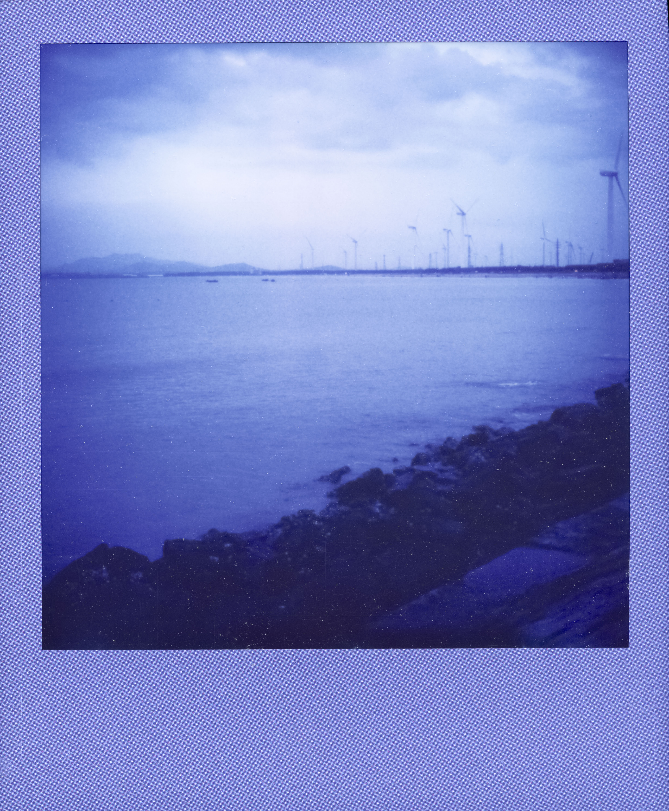
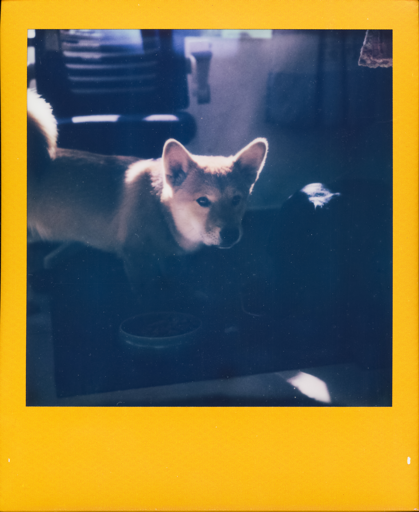
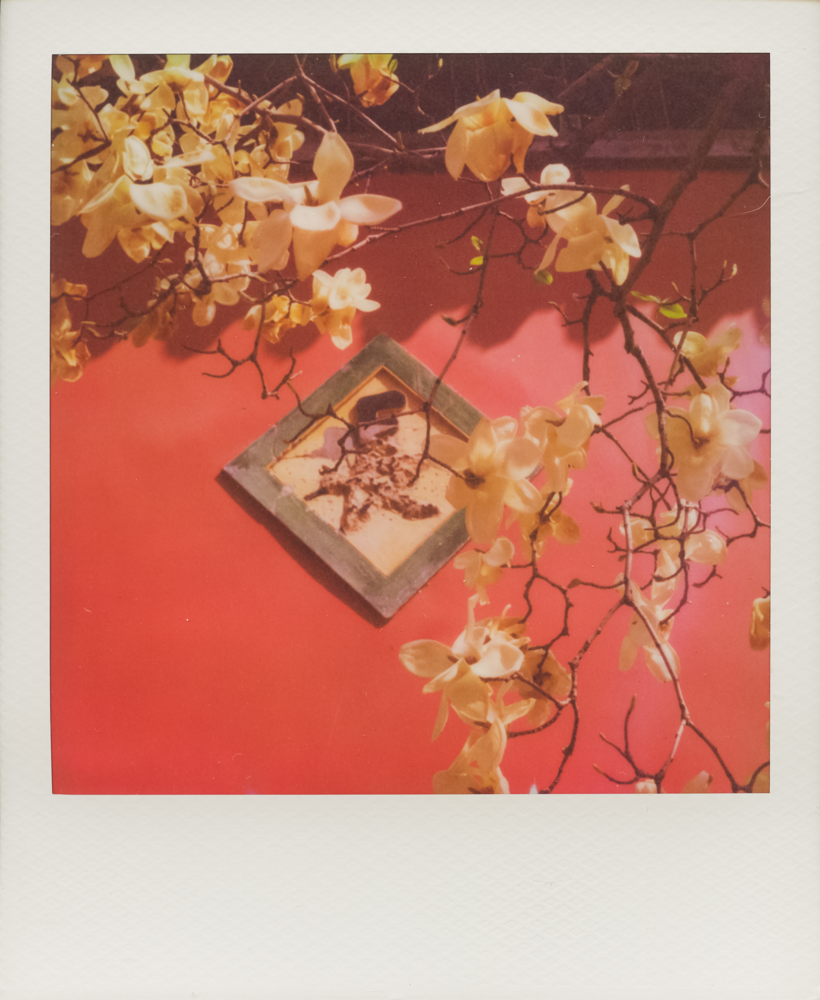

# PolaMiya - 宝丽来相机改装项目

**代码仓库：[PolaMiyaSoftware](https://github.com/ZeshuLiu/PolaMiyaSoftware)**

**硬件仓库（电路及结构）：[PolaMiyaHardware](https://github.com/ZeshuLiu/PolaMiyaHardware)**

> 本仓库保留项目整体说明，代码和硬件设计文件已分别迁移至上述独立仓库。

宝丽来相机一台，具有测距、电动吐片等功能。

## 已实现功能

1. 电动吐片
2. 激光测距
3. 温度显示（核心 PCB 及芯片温度）
4. 屏幕显示控制
5. 闪光灯控制（经 MCU）

## 说明

项目比较简单，需要采购的大件只有两个：
- Mamiya Press 127mm 镜头（不需要调焦桶）
- 宝丽来 AF5000（需要里面的吐片下巴、吐片电机和齿轮组）

详细的结构件和装配说明请参考 **[PolaMiyaHardware](https://github.com/ZeshuLiu/PolaMiyaHardware)** 仓库。

## 硬件设计

电路及结构设计文件位于 **[PolaMiyaHardware](https://github.com/ZeshuLiu/PolaMiyaHardware)** 仓库，包含：
- PCB 设计
- 3D 打印结构件
- 装配图纸

## 软件代码

源代码位于 **[PolaMiyaSoftware](https://github.com/ZeshuLiu/PolaMiyaSoftware)** 仓库，包含：
- 主控器固件（MainController2）
- 电源管理固件（PowerManage2）
- CubeMX 配置及 Keil uVision 工程

## 使用方法

机身左下角按钮长按 2 秒开机或关机；三向按钮长按中键 2 秒吐片电机开始运行，随后短按吐片电机停止；在吐片电机运行时推动侧面推杆，相纸即吐出；测距开机即运行。

## 样片

## 后续计划

1. 测光
2. 全息取景器（已开始设计）

## 已知问题

1. 吐片口密封性能不好，严禁在有相纸的情况下打开片仓（不中途打开片仓密封性没有问题）

## 已修复问题

1. （主控器 Rev1.0 硬件）相机吐片电机运行后会导致测距停止，该问题由硬件导致，已经在 Rev1.2 硬件中修复
2. （主控器 Rev1.0 硬件）温度传感器布置位置不合理，测得的温度受芯片运行发热影响较大。已经在 Rev1.2 硬件中修复
